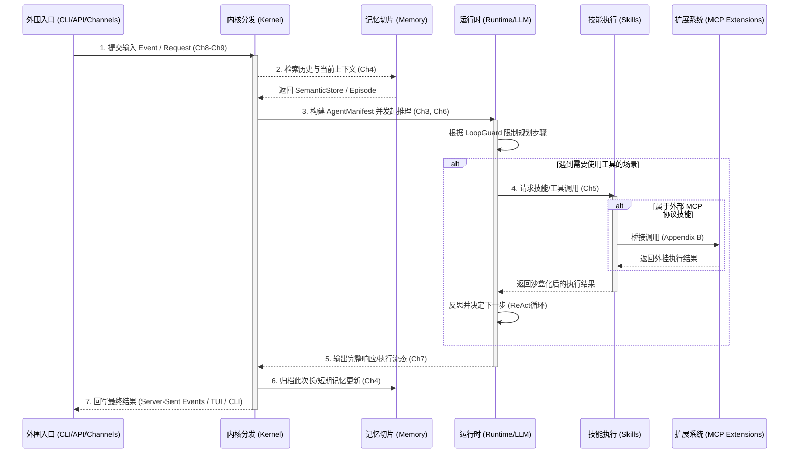

# 第零章：13 个 Crate 的系统总览 —— OpenFang 系统解剖

> ZeroClaw 更像一把单体工具：单个 crate，结构集中，拿起来就能直接分析。  
> OpenFang 更像一套分舱系统：13 个独立舱室可以分别维护，目标是支撑长期演进。

如果你读过 ZeroClaw 教程，你会记得它的全部代码住在 `zeroclaw/src/` 这一个目录里——30 多个模块，但只有一个 Crate。打开 `Cargo.toml`，只有一行 `[package]`。

打开 OpenFang 的根 `Cargo.toml`，你看到的是完全不同的景象：

```toml
[workspace]
resolver = "2"
members = [
    "crates/openfang-types",      # 系统的"公共语言"（零业务逻辑）
    "crates/openfang-memory",     # 记忆基底
    "crates/openfang-runtime",    # Agent 执行引擎
    "crates/openfang-wire",       # P2P 网络协议
    "crates/openfang-api",        # REST/WS/SSE API 服务
    "crates/openfang-kernel",     # 系统调度内核
    "crates/openfang-cli",        # 交互式终端 (Ratatui TUI)
    "crates/openfang-channels",   # 40 种通讯平台适配
    "crates/openfang-migrate",    # 数据迁移工具
    "crates/openfang-skills",     # 可热插拔的技能系统
    "crates/openfang-desktop",    # Tauri 桌面端
    "crates/openfang-hands",      # 自主 Agent 能力包
    "crates/openfang-extensions", # MCP 扩展市场
    "xtask",                      # 构建任务编排
]
```

## 第一次阅读建议

如果你是第一次接触三分教程，可以把这一章当成 OpenFang 的总装图，而不是逐 crate 的深潜章节。

建议按这个顺序读：

1. 先看上面的 workspace 成员列表，建立“这是多 crate 系统”这个基本印象。
2. 再看下面的“洋葱模型”依赖树，搞清楚哪些层属于核心，哪些层贴近用户。
3. 然后跳到 [openfang_tutorial_chapter_1.md](./openfang_tutorial_chapter_1.md) 和 [openfang_tutorial_chapter_2.md](./openfang_tutorial_chapter_2.md)，先理解内核启动和执行循环。
4. 最后再回到本章后半段，把 `AgentManifest`、`ResourceQuota`、`OpenFangKernel` 这些关键结构放回整体地图里理解。

如果你只有 30 分钟，本章最值得先抓住的是三件事：

- OpenFang 是 workspace 系统，不是单 crate 应用。
- `types -> runtime/memory -> kernel -> api/channels/cli/desktop` 这条依赖主干决定了它的演进边界。
- 它和 OpenClaw、ZeroClaw 的关系不是“新旧版本”，而是不同层次的问题分工。

> **架构师锚点：它在代码库的哪里？**
> 对于 13 个 Crate，如果你感到迷茫，请记住下面这个**“洋葱模型”层级依赖树**，越靠上的越底层（没有外部依赖），越靠下的越贴近用户：
>
> ```text
> 📦 openfang/crates/
> ├── 🧠 openfang-types/     (Layer 0: 零逻辑，定义系统所有 Struct 与 Enum)
> ├── 🗄️ openfang-memory/    (Layer 1: SQLite 基底，依赖 types)
> ├── ⚡ openfang-runtime/   (Layer 1: ReAct 引擎和工具沙箱，依赖 types)
> ├── ⚙️ openfang-kernel/    (Layer 2: 中枢总线，组合 memory + runtime)
> ├── 🔌 openfang-skills/    (Layer 3: 业务域逻辑，依赖 kernel)
> ├── 🤖 openfang-hands/     (Layer 3: 各种自动化角色，依赖 kernel)
> ├── 🧩 openfang-extensions/(Layer 3: MCP 原生支持，依赖 kernel)
> ├── 🌐 openfang-wire/      (Layer 3: A2A 通信协议，依赖 kernel)
> ├── 📡 openfang-api/       (Layer 4: 面向前端的 HTTP 网关，包装前面的所有能力)
> ├── 🌉 openfang-channels/  (Layer 4: Discord/Slack/飞书桥接器，依赖 api/kernel)
> ├── ⌨️ openfang-cli/       (Layer 5: CLI 和终端 UI)
> ├── 🖥️ openfang-desktop/   (Layer 5: Tauri 桌面客户端)
> └── 🚚 openfang-migrate/   (Layer X: 独立工具，用于从 OpenClaw 导入数据)
> ```
>
> 任何时候在后续章节中迷失了方向，都可以回到这棵树，看看当前处于“洋葱”的第几层。

这是一个 **Cargo Workspace**——Rust 的多包工程组织形式。严格说，当前 workspace 有 **13 个业务 crate + 1 个工程辅助成员 `xtask`**。本章标题仍然写“13 个 Crate”，是因为我们讨论的重点是那 13 个直接承载产品能力的舱室；但 `xtask` 的存在同样关键，它说明 OpenFang 连构建编排都被纳入了 workspace 纪律，而不是散落在外部脚本里。

---

> **先打破对“三个项目”的刻板印象。**
> 在此之前，你可能认为“OpenClaw 是老版”、“ZeroClaw 是小实验”、“OpenFang 是大作”……
> 深入源码 `zeroclaw/src/` 后，你会发现它里面包含 `peripherals/arduino_flash.rs`、`rpi.rs` 和 `hardware/gpio.rs` —— **ZeroClaw 并不只是“轻量级测试框架”，它本身就是一套面向 Edge AI / 机器人硬件的 Agent 运行时。**
>
> 现在我们需要重新定义这三者的灵魂：
>
> 1. **ZeroClaw 🔬 (Edge AI / 硬件终端)**：为了跑在树莓派和单片机上，它砍掉了一切云原生组件，追求极致轻量和本地硬件协议（I2C/GPIO）的直接打通。
> 2. **OpenClaw 🚧 (IM 多渠道聚合层)**：建立在 Node.js 的动态生态上，专门用来在各种脏乱差的微信、Telegram 群聊里收发消息。
> 3. **OpenFang 🎯 (云原生 Agent OS)**：它完全剥离了 ZeroClaw 的硬件层，吸收了 OpenClaw 的多渠道抽象，加入了一套严密的权限、额度和审计中枢。它是一台能架设在云端的 ServerOS。

## 0.0 全书导读：端到端消息生命周期（数据流全景图） 🗺️

在深入解析各个 Crate 的内部构造前，我们需要建立一个**端到端数据流宏观坐标系**。当一个用户（或者外部系统）发送一条消息给 OpenFang，系统内部是如何流转的？全书的各个章节分别对应图中的哪一个处理阶段？以下是一条完整消息的生命周期：



这张图是贯穿全书的**导游地图**：

- 第一章讲 **Kernel** 的初始化。
- 第二/三章聚焦 **Types** 与 **架构哲学**。
- 第四章讲 **Memory** 与上下文。
- 第五章讲 **Skills**。
- 第六/七章深入 **Runtime** 的大循环与调度。
- 第八/九章讲如何给这套内核架设 **API/CLI** 外壳。

---

## 0.1 关键场景：为什么全景章必须先讲 workspace，而不是先讲 kernel？ 🎬

第零章如果只是把 13 个 crate 列成清单，价值会很有限。它真正服务的是 4 类系统演进场景：

1. **多人并行开发场景**
   当 API、channels、runtime、desktop、skills 同时演进时，最重要的问题不是“代码放在哪”，而是如何让依赖方向、编译代价和模块边界不失控。

2. **产品壳持续外扩场景**
   OpenFang 不只是 runtime。CLI、desktop、channels、extensions 都在向外长，这时 workspace 拆分决定了“壳的扩张”会不会反向污染内核。

3. **旧生态迁移场景**
   `openfang-migrate` 的存在说明系统不是从真空里重新发明，而是要把 OpenClaw 之类的旧资产接进来。全景章必须先让读者看见：迁移、桌面分发、渠道接入都已经被放进正式工程边界里。

4. **异构执行持续增加场景**
   后面章节会看到 Node/Python skill、browser、MCP、桌面内嵌 server 等异构面。第零章先建立 crate 边界，读者后面才能判断这些能力是“核心层职责”还是“外围层职责”。

所以，这一章真正回答的不是“OpenFang 有哪些 crate”，而是：**OpenFang 把哪些复杂性收进核心，哪些复杂性外放到边界层，并通过 workspace 把这种分工固定下来。**

---

## 1. 为什么要拆成 13 个 Crate？

不是为了显摆架构复杂度。Workspace 拆分是一种**可被编译器强制执行的工程纪律**。

### 1.1 编译防火墙

在 ZeroClaw 里，改一个工具的实现，整个项目可能重新编译。在 OpenFang 里：

```
修改 crates/openfang-channels/src/telegram.rs
    → 触发重编：openfang-channels, openfang-api, openfang-kernel
    → 安全地跳过：openfang-runtime, openfang-memory, openfang-wire
```

Cargo 的增量编译只重建变更的 Crate 及其下游依赖。在 13.7 万行的代码库里，这能把开发时的编译时间从 3 分钟降到 15 秒。

### 1.2 依赖方向图（永不循环）

```
          ┌─────────────────────────────────────────────────────────┐
          │                   openfang-types                        │
          │           (零依赖：只有 serde/uuid/chrono)              │
          └──────────────────┬──────────────────────────────────────┘
                             │ 所有其他 Crate 都依赖 types
          ┌──────────────────┼──────────────────────────────────────┐
          │                  │                                      │
          ▼                  ▼                                      ▼
   openfang-memory    openfang-wire             openfang-runtime
   （记忆基底）         （P2P协议）               （执行引擎）
          │                  │                        │
          └──────────────────┴──────────┬─────────────┘
                                        │
                                        ▼
                                openfang-kernel
                                （调度总线）
                                        │
                          ┌─────────────┴─────────────┐
                          │                           │
                          ▼                           ▼
                   openfang-api              openfang-channels
                   （HTTP服务）              （通讯平台层）
                          │                           │
                          └──────────────┬────────────┘
                                         │
                         ┌───────────────┼──────────────┐
                         │               │              │
                         ▼               ▼              ▼
                  openfang-cli    openfang-desktop   openfang-hands
                  (TUI终端）       (桌面端)           (自主Agent)
```

这张有向无环图(DAG)有一个**编译期约束**：Rust 的 Cargo 不允许循环依赖。如果你试图在 `openfang-runtime` 里 `use openfang-kernel::something`，编译器会直接拒绝——而在 ZeroClaw 的单 Crate 里，类似的逻辑耦合更容易在运行时逐步累积。

### 1.3 代码量分布

| Crate                   | 行数   | 主要文件                                              | 职责                               |
| ----------------------- | ------ | ----------------------------------------------------- | ---------------------------------- |
| **openfang-runtime**    | 35,081 | `agent_loop.rs`, `tool_runner.rs`, `model_catalog.rs` | Agent 执行引擎，工具运行，模型管理 |
| **openfang-cli**        | 28,275 | `main.rs`, `tui/mod.rs`, `tui/event.rs`               | 交互式 TUI 终端                    |
| **openfang-channels**   | 24,015 | `bridge.rs` + 40 个平台适配器                         | 通讯平台层                         |
| **openfang-types**      | 10,387 | `agent.rs`, `config.rs`, `error.rs`                   | 全局共享类型（**无业务逻辑**）     |
| **openfang-kernel**     | 15,047 | `kernel.rs`, `workflow.rs`, `triggers.rs`             | 系统调度内核                       |
| **openfang-api**        | 16,901 | `routes.rs`, `ws.rs`, `server.rs`                     | REST/WS/SSE API                    |
| **openfang-memory**     | 3,919  | `session.rs` + SQLite 基底                            | 记忆与会话持久化                   |
| **openfang-migrate**    | 4,525  | `openclaw.rs`                                         | 从旧版迁移数据                     |
| **openfang-skills**     | 3,443  | 技能注册与热加载                                      | Markdown 技能包系统                |
| **openfang-extensions** | 2,862  | 扩展市场注册                                          | MCP 扩展安装管理                   |
| **openfang-hands**      | 1,571  | 自主 Agent 注册                                       | 预置自主能力包                     |
| **openfang-wire**       | 1,684  | `peer.rs`                                             | Ed25519 鉴权 + P2P 协议            |
| **openfang-desktop**    | 881    | Tauri 胶水代码                                        | 跨平台桌面端                       |

---

### 1.4 从对标项目看到的五个外延能力压力点

如果只看 OpenFang 自己的 crate 列表，这一节容易停留在“模块划分合理”这一层。把 OpenClaw 和 ZeroClaw 一并放进视野后，会更容易看见另外五类现实压力：节点网络、渠道汇聚、审计追责、成本治理，以及浏览器侧的原生控制。这些能力不必被误读成“OpenFang 现在已经全部具备”，但它们确实能帮助我们判断这套系统未来会被哪些真实需求继续拉扯。

#### 1.4.1 节点互联不是抽象概念，而是协议与鉴权问题

`crates/openfang-wire/src/peer.rs` 表明，节点互联一旦落到实现层，核心问题很快就会从“要不要连”转为“如何握手、如何鉴权、如何组织消息边界”。这里已经能看到长度头、JSON frame 和签名校验这类协议级考虑，它提醒我们：Agent 网络扩展到多机之后，通信层会迅速变成一级架构问题。

#### 1.4.2 渠道接入一旦扩张，系统就会面临统一入口压力

`openclaw/src/channels`、`routing/resolve-route.ts` 和 `channels/dock.ts` 说明，多渠道接入的关键并不只是“支持的平台数量”，而是能不能把异构消息面收成统一漏斗。对 OpenFang 来说，这类实现是一个明确提醒：只要产品继续向真实渠道扩张，输入输出标准化就会成为接入面的长期压力。

#### 1.4.3 审计面最终要回答的是“发生过什么，能否追责”

这就要求所有的权限变更、系统调用、外部请求都必须落入无法篡改（或极难篡改）的日志链条。OpenClaw 的做法是让所有 Shell 执行留痕，而 OpenFang 的 `openfang-kernel` 和 `AuditLog` 需要进一步将其固化为 Merkle Tree 级别的结构，甚至对接远程审计。

> 💡 **架构实战指引**：关于如何将 OpenClaw 的工程精髓（如 Shell 拦截、流式计费、多渠道适配）逐步“Rust 化”并在这些 Crate 中落地，请见 **[附录 D.4：OpenFang 工业级进化蓝图——吸收 OpenClaw 工程精髓的 5 阶段演进计划](./openfang_tutorial_appendix_d_evolution_engineering.md)**，那里提供了一条具体的操作路线图。`crates/openfang-runtime/src/audit.rs` 已经展示出一条很清楚的路线：高风险动作的记录不能只是普通日志，而要逐步走向可验证、可追溯、可解释的审计面。无论最终落在 TUI、dashboard 还是外部治理系统，这一层都决定了 Agent 系统能不能进入更高风险的生产场景。

#### 1.4.4 成本治理迟早会从统计报表升级为运行约束

ZeroClaw 的 `economic/tracker.rs` 和 `classifier.rs` 所展示的，不只是成本可视化，而是把“预算”“收益预估”“任务价值判断”逐步推进成运行时约束。它给 OpenFang 的启发很直接：只要系统未来希望长期运行、多 Agent 并发协同，资源与成本就不能永远停留在事后复盘层。

#### 1.4.5 浏览器控制深度决定了外部执行面的上限

`openclaw/src/browser/chrome.executables.ts` 与 `cdp.ts` 说明，一旦系统要进入浏览器自动化和复杂外部操作场景，单纯依赖高层封装往往不够，最终仍要面对 CDP、宿主浏览器状态、指纹差异和会话接管这类底层细节。对 OpenFang 而言，这不是立即要照搬的能力清单，而是一个很现实的边界提醒：外部执行面越真实，控制层就越不能只停留在抽象接口。

### 1.5 两个经常被忽略的边缘 Crate：`openfang-migrate` 与 `openfang-desktop`

前面的表格里，这两个 crate 很容易被一眼扫过去，因为它们一个看起来像“一次性工具”，另一个看起来像“薄 UI 壳”。但源码表明，它们都不是可有可无的装饰层。

#### `openfang-migrate`：不是脚本堆，而是有报告面的迁移引擎

`openfang-migrate/src/lib.rs` 的主入口非常清楚：

- `MigrateSource`（L13）
- `MigrateOptions`（L34）
- `run_migration()`（L46）

这说明它不是一堆 ad-hoc 脚本，而是已经被抽象成“来源框架 + 源目录 + 目标目录 + dry-run”的正式迁移接口。

更关键的实现其实在 `openclaw.rs`：

- `detect_openclaw_home()`（L721）
- `scan_openclaw_workspace()`（L766）
- `ScanResult`（L1027）
- `ScannedAgent`（L1038）
- `migrate()`（L1054）

这套结构说明迁移并不是盲拷文件，而是先做工作区探测与清点，再决定如何导入 Agent、channels、skills、memory。它甚至显式兼容多种 OpenClaw 历史目录名与配置格式，这一点非常有“旧系统迁移脏活”的味道。

`report.rs` 则进一步证明它不是“迁完就算”：

- `MigrationReport`（L7）
- `ItemKind`（L44）
- `to_markdown()`（L70）
- `print_summary()`（L136）

也就是说，OpenFang 的迁移层已经具备了一个很务实的产品判断：**迁移不是只有导入动作，还必须留下人类可审阅的报告面。**

这让 `openfang-migrate` 虽然代码量不大，却承担了一个非常关键的生态过渡职责：把 OpenClaw 资产搬进来，而且尽量让用户知道哪些东西迁进来了、哪些被跳过了、下一步该做什么。

#### `openfang-desktop`：不是 WebView 壳，而是“内嵌内核 + 原生外设能力”的包装层

`openfang-desktop/src/lib.rs` 顶部注释直接写了它的职责：boot kernel、启动内嵌 API server、打开原生窗口、系统托盘、单实例、原生通知、全局快捷键、开机自启、更新检查。

主入口集中在：

- `PortState`（L22）
- `KernelState`（L25）
- `run()`（L32）

这说明桌面端不是“外部浏览器打开 dashboard”，而是**自己持有内核与嵌入式 server 状态**。

这种定位在 `server.rs` 里更清楚：

- `ServerHandle`（L14）
- `shutdown()`（L27）
- `start_server()`（L49）

`start_server()` 的行为是：

1. 直接 `OpenFangKernel::boot(None)`
2. 绑定 `127.0.0.1:0` 随机本地端口
3. 在单独线程里起自己的 tokio runtime
4. 用 `build_router()` 跑嵌入式 API server

也就是说，桌面端不是单纯消费一个外部 daemon，而是**自己把内核和 API 服务嵌到桌面应用生命周期里**。这比“套一个 Tauri 窗口”要重得多。

`commands.rs` 进一步表明它不是纯展示层，而是带原生操作面的桌面控制壳：

- `get_status()`（L17）
- `get_agent_count()`（L34）
- `import_agent_toml()`（L43）
- `import_skill_file()`（L87）
- `get_autostart()`（L125）
- `set_autostart()`（L131）
- `open_config_dir()`（L159）
- `open_logs_dir()`（L167）

这些入口说明桌面端不仅能显示现状，还能调用本机文件选择器、导入 Agent/Skill、切开机自启、打开配置和日志目录。这不是“桌面皮肤”，而是一个有原生 OS 集成能力的产品壳。

#### 这两个 crate 为什么值得在全景章里点名

因为它们共同说明了一件事：OpenFang 的 workspace 不是只有“内核大脑”和“协议骨架”，它还认真处理了两个经常被教程忽略的产品边角：

1. **生态迁移入口**：如何把旧系统用户带进来
2. **桌面分发入口**：如何把 daemon/API/TUI 以外的本机体验补齐

所以这两个 crate 虽然不是最大、最核心、最常改的舱室，但它们恰好揭示了 OpenFang 的另一种野心：**不只是做 Agent runtime，也要做完整产品落地面。**

---

## 2. `openfang-types`：系统的公共语言

`openfang-types` 是整个体系的地基。它的 `lib.rs` 只有 72 行，其中 50 行都是导出声明：

```rust
// openfang-types/src/lib.rs
pub mod agent;        // Agent 生命周期、Manifest、状态机
pub mod approval;     // 人工审批工作流
pub mod capability;   // RBAC 权限系统
pub mod comms;        // 渠道消息类型
pub mod config;       // 全局配置 (KernelConfig)
pub mod error;        // 统一错误枚举
pub mod event;        // 事件总线消息类型
pub mod manifest_signing; // Ed25519 Manifest 签名
pub mod media;        // 图片/音频/视频类型
pub mod memory;       // 记忆条目类型
pub mod message;      // LLM 对话消息类型
pub mod model_catalog;    // 模型目录（120+ 模型的元数据）
pub mod scheduler;    // 定时任务类型
pub mod serde_compat; // 容错序列化辅助
pub mod taint;        // 污染追踪（安全补丁）
pub mod tool;         // 工具定义与调用类型
pub mod tool_compat;  // 跨版本工具兼容
pub mod webhook;      // Webhook 事件类型
```

这个 Crate **不包含任何业务逻辑**——没有数据库操作，没有 HTTP 调用，没有 LLM 调用。它只定义"语言"：运行在这套系统里的所有数据结构。

**为什么这样设计？**

因为它是所有 Crate 的共同依赖。如果 `openfang-types` 引入了 `reqwest` 或 `sqlx`，所有 13 个 Crate 都会被拖入一个庞大的编译图。保持它的零逻辑，才能让它成为轻量、快速编译的"公共语言层"。

这一点在 `crates/openfang-types/Cargo.toml` 里也能得到更硬的侧证：它当前依赖的主要还是 `serde`、`serde_json`、`chrono`、`uuid`、`thiserror`、`toml`、`async-trait`、`ed25519-dalek`、`sha2`、`hex`、`rand` 这些“语言层 / 类型层 / 安全基础件”，而没有把 `reqwest`、`axum`、`rusqlite`、`wasmtime` 这类重运行时依赖拖进来。这正是 workspace 里“公共语言层”该有的克制。

---

## 3. 错误处理哲学：`thiserror` vs `anyhow`

ZeroClaw 的错误处理策略是 `anyhow::Result<T>`——在任何函数里，一句 `?` 就能把所有错误类型转换成一个通用的 `anyhow::Error` 向上传播。简单，直接，但代价是**调用方无法知道收到什么类型的错误**。

OpenFang 选择了另一条路：

```rust
// openfang-types/src/error.rs
use thiserror::Error;

#[derive(Error, Debug)]
pub enum OpenFangError {
    #[error("Agent not found: {0}")]
    AgentNotFound(String),

    #[error("Agent already exists: {0}")]
    AgentAlreadyExists(String),

    #[error("Capability denied: {0}")]
    CapabilityDenied(String),

    #[error("Resource quota exceeded: {0}")]
    QuotaExceeded(String),

    // 注意：带命名字段的变体（更清晰的错误上下文）
    #[error("Agent is in invalid state '{current}' for operation '{operation}'")]
    InvalidState { current: String, operation: String },

    #[error("Tool execution failed: {tool_id} — {reason}")]
    ToolExecution { tool_id: String, reason: String },

    #[error("WASM sandbox error: {0}")]
    Sandbox(String),

    #[error("IO error: {0}")]
    Io(#[from] std::io::Error),  // 自动 From 转换

    #[error("Auth denied: {0}")]
    AuthDenied(String),

    #[error("Max iterations exceeded: {0}")]
    MaxIterationsExceeded(u32),

    // ... 20+ 个精确错误变体
}

// 全库统一的 Result 别名
pub type OpenFangResult<T> = Result<T, OpenFangError>;
```

**有什么具体好处？**

```rust
// 调用方可以精确 match 错误类型：
match kernel.dispatch_message(agent_id, msg).await {
    Err(OpenFangError::AgentNotFound(id)) => {
        // 告诉用户 Agent 不存在
    }
    Err(OpenFangError::QuotaExceeded(reason)) => {
        // 告诉用户超出了资源限制
    }
    Err(OpenFangError::Sandbox(e)) => {
        // WASM 沙箱错误，记录审计日志
    }
    Err(e) => return Err(e),
    Ok(result) => { ... }
}
```

在 ZeroClaw 里，上面的 `match` 根本无法写——你只得到一个 `anyhow::Error`，只能 `format!("{}", e)` 然后靠字符串 `contains("not found")` 来猜错误类型。

---

## 4. Agent 的"生命手册"：`AgentManifest`

如果说 ZeroClaw 里的 Agent 是一个业务对象（一个 Struct），那 OpenFang 里的 Agent 更像一个**活的实体**——它有身份、有状态、有权限声明、有资源配额、有调度策略。这一切都来自 `AgentManifest`：

```rust
// openfang-types/src/agent.rs — AgentManifest（精简版）
pub struct AgentManifest {
    pub name: String,         // 人类可读名称
    pub version: String,      // 语义版本 (SemVer)
    pub description: String,
    pub author: String,
    pub module: String,       // "builtin:chat" | "my_agent.wasm" | "agent.py"

    // 调度策略 ——
    pub schedule: ScheduleMode,  // Reactive | Periodic(cron) | Proactive | Continuous

    // LLM 配置
    pub model: ModelConfig,
    pub fallback_models: Vec<FallbackModel>, // 故障转移模型链

    // 资源配额（MeteringEngine 强制执行）
    pub resources: ResourceQuota,

    // 权限声明（RBAC）
    pub capabilities: ManifestCapabilities,
    pub profile: Option<ToolProfile>,  // Minimal|Coding|Research|Messaging|Full

    // 技能与扩展
    pub skills: Vec<String>,
    pub mcp_servers: Vec<String>,

    // 自主模式守护参数
    pub autonomous: Option<AutonomousConfig>,

    // 工具访问控制
    pub tool_allowlist: Vec<String>,
    pub tool_blocklist: Vec<String>,
}
```

`ScheduleMode` 是 OpenFang 区别于 ZeroClaw 最鲜明的特征之一：

```rust
pub enum ScheduleMode {
    Reactive,           // 被动响应：等待消息触发（默认）
    Periodic { cron: String },           // 定时触发：Cron 表达式
    Proactive { conditions: Vec<String> }, // 条件监控：满足条件时主动行动
    Continuous { check_interval_secs: u64 }, // 持续循环：每 N 秒轮询
}
```

ZeroClaw 只有 `Reactive` 模式（等待触发）。OpenFang 的 Agent 可以是一个**每天早上自己醒来工作的自主守护进程**。

---

## 5. `ResourceQuota`：精算师式的成本管理

OpenFang 给每个 Agent 分配了精确的资源配额：

```rust
pub struct ResourceQuota {
    pub max_memory_bytes: u64,          // 最大内存（默认 256MB）
    pub max_cpu_time_ms: u64,           // 单次调用 CPU 时间（默认 30s）
    pub max_tool_calls_per_minute: u32, // 工具调用速率（默认 60/分钟）
    pub max_llm_tokens_per_hour: u64,   // LLM Token 消耗（默认 100万/小时）
    pub max_network_bytes_per_hour: u64, // 网络流量（默认 100MB/小时）
    pub max_cost_per_hour_usd: f64,     // 小时成本（默认 $1.00）
    pub max_cost_per_day_usd: f64,      // 日成本（0 = 不限）
    pub max_cost_per_month_usd: f64,    // 月成本（0 = 不限）
}
```

这些配额不是摆设——`MeteringEngine` 会实时追踪每个 Agent 的消耗，超限时自动熔断。这是 ZeroClaw 完全没有的系统级成本控制机制。

---

## 6. `OpenFangKernel`：30 个字段的"中央总线"

ZeroClaw 的 `AppState` 大概有 6-8 个字段。OpenFang 的 `OpenFangKernel` 有 **30 个字段**，每一个都是一个独立子系统：

```rust
pub struct OpenFangKernel {
    pub config: KernelConfig,             // 系统配置
    pub registry: AgentRegistry,          // Agent 注册表
    pub capabilities: CapabilityManager,  // RBAC 权限引擎
    pub event_bus: EventBus,              // 松耦合事件总线
    pub scheduler: AgentScheduler,        // 调度器
    pub memory: Arc<MemorySubstrate>,     // 记忆基底
    pub supervisor: Supervisor,           // 进程监督者
    pub workflows: WorkflowEngine,        // 工作流引擎
    pub triggers: TriggerEngine,          // 事件触发引擎
    pub background: BackgroundExecutor,   // 后台任务执行器
    pub audit_log: Arc<AuditLog>,         // Merkle 哈希链审计日志
    pub metering: Arc<MeteringEngine>,    // 成本计量引擎
    pub wasm_sandbox: WasmSandbox,        // WASM 沙箱
    pub auth: AuthManager,               // RBAC 认证管理器
    pub model_catalog: RwLock<ModelCatalog>, // 120+ 模型的目录
    pub skill_registry: RwLock<SkillRegistry>, // 技能注册表
    pub running_tasks: DashMap<AgentId, AbortHandle>, // 正在运行的 Agent（无锁 HashMap）
    pub mcp_connections: Mutex<Vec<McpConnection>>, // MCP 服务器连接
    pub mcp_tools: Mutex<Vec<ToolDefinition>>,      // MCP 工具缓存
    pub a2a_task_store: A2aTaskStore,              // A2A 任务追踪
    pub web_ctx: WebToolsContext,                  // SSRF 保护的 Web 工具上下文
    pub browser_ctx: BrowserManager,              // Playwright 浏览器自动化
    pub media_engine: MediaEngine,                // 图片/音频理解引擎
    pub tts_engine: TtsEngine,                    // 文字转语音引擎
    pub pairing: PairingManager,                  // 设备配对管理
    pub embedding_driver: Option<Arc<dyn EmbeddingDriver>>, // 向量嵌入驱动
    pub hand_registry: HandRegistry,              // 自主 Agent 能力包注册
    pub extension_registry: RwLock<IntegrationRegistry>, // MCP 扩展市场
    pub hooks: HookRegistry,                      // 生命周期钩子注册
    pub process_manager: Arc<ProcessManager>,     // 持久进程管理器（REPL/服务器）
    pub peer_node: Option<Arc<PeerNode>>,         // OFP P2P 节点
    pub cron_scheduler: CronScheduler,            // 定时任务调度器
    pub approval_manager: ApprovalManager,        // 工具执行审批管理器
    // ... 还有若干辅助字段
}
```

这 30 个字段共同构成了 OpenFang 的运行时骨架——每个字段都对应一个独立子系统，彼此通过 `EventBus` 和明确的函数调用来通信，不会共享一把大锁。

注意 `running_tasks: DashMap<AgentId, AbortHandle>`——这是用 `dashmap`（无锁并发 HashMap）而非 `Mutex<HashMap>` 来存储运行中的 Agent。在高并发场景下，不同 Agent 的取消操作完全不会相互阻塞。

还有一个精妙的细节：

```rust
self_handle: OnceLock<Weak<OpenFangKernel>>,
```

`OnceLock` 是 Rust 标准库的一次性初始化容器，这里存储的是 Kernel 自身的弱引用。因为 `OpenFangKernel` 需要在某些子系统的回调里引用自身（比如 Trigger 发射时调用 Kernel 的 `dispatch_message`），但在初始化阶段 `Arc<Self>` 还不存在。`OnceLock<Weak<Self>>` 的模式解决了这个"先有鸡还是先有蛋"的问题——先构建 Kernel 本体，然后在 Arc 包装之后再回填弱引用。

---

## 7. Workspace 的"公共依赖声明"机制

打开 OpenFang 根 `Cargo.toml` 的 `[workspace.dependencies]` 节，会看到 40+ 条全局依赖声明：

```toml
[workspace.dependencies]
tokio = { version = "1", features = ["full"] }
serde = { version = "1", features = ["derive"] }
dashmap = "6"               # 无锁并发 HashMap（对标 std::HashMap + Mutex）
thiserror = "2"             # 类型化错误枚举（对标 anyhow）
zeroize = { version = "1", features = ["derive"] }  # 内存零化（安全必需品）
wasmtime = "41"             # WASM 沙箱引擎
governor = "0.8"            # 令牌桶速率限制（对标手写计数器）
ed25519-dalek = { version = "2", features = ["rand_core"] } # P2P 签名
aes-gcm = "0.10"            # AES-256-GCM 加密
argon2 = "0.5"              # 密码哈希（KDF）
# ...
```

每个 Crate 的 `Cargo.toml` 只需要 `dashmap.workspace = true` 就能继承这个声明，**不需要重复指定版本**。这确保了整个 Workspace 里同一个库只有一个版本，消除了版本不一致导致的 ABI 冲突。

这几个依赖背后的设计意图：

- **`dashmap`**：并发读写 HashMap，分片锁设计，比 `Mutex<HashMap>` 在高并发场景快 2-8 倍
- **`zeroize`**：密钥/Token 在离开作用域时自动覆零，防止 core dump 泄露
- **`governor`**：令牌桶速率限制，工业级实现，取代手写计数器
- **`wasmtime`**：Mozilla 开发的工业级 WASM 运行时，支持 Fuel 计量（让每条指令都"消耗油量"）

---

## 8. ToolProfile：预设工具包

OpenFang 提供了 6 种预设工具包（`ToolProfile`），让 Agent 的工具配置变成一行声明：

```rust
pub enum ToolProfile {
    Minimal,      // [file_read, file_list]
    Coding,       // [file_read/write, shell_exec, web_fetch]
    Research,     // [web_fetch, web_search, file_read/write]
    Messaging,    // [agent_send/list, memory_*]
    Automation,   // 上述全部
    Full,         // ["*" — 所有工具]
    Custom,       // 手动声明 capabilities
}
```

在 Agent 的 TOML 配置里：

```toml
[agent]
name = "my-researcher"
profile = "research"  # 展开为: web_fetch + web_search + file_read + file_write
# 无需逐一声明工具，也无需手写 capabilities
```

`profile.implied_capabilities()` 还会根据工具列表**自动推导出能力声明**——如果 profile 包含 `web_fetch`，就自动获得 `network: ["*"]` 能力。

---

## 8.5 已知边界与限制

1. **第零章是边界图，不是逐 crate 深潜手册**：这一章的任务是先建立 workspace 分工，而不是把每个 crate 都讲到 Ch1-Ch6 那种链路深度。
2. **Workspace 图是主干视图，不是完整依赖图**：像 `xtask` 这种工程成员、以及若干更细的交叉依赖，并没有全部画进图里；图的目标是帮助理解演进边界，而不是替代 `cargo metadata`。
3. **声明式字段不等于执行闭环已经完成**：像 `ResourceQuota`、`ToolProfile` 这些类型定义在第零章里非常重要，但它们的实际执法强度要回到第五章、第三章和第四章才看得完整。
4. **行数与模块规模会持续漂移**：workspace 级系统在快速演进时，crate 行数、字段数、路由数都可能很快变化，因此第零章更应该强调结构关系与工程角色，而不是把静态数字误读成长期不变的系统常量。

---

## 8.6 交叉引用导读 📖

这一节同时承担全书章节导读的作用，方便你在进入正文前先建立整体阅读路线。

| 章         | 标题                                              | 核心内容                                                                       |
| ---------- | ------------------------------------------------- | ------------------------------------------------------------------------------ |
| **第零章** | 13 个 Crate 的系统总览——OpenFang 系统解剖         | Workspace 解剖、依赖拓扑、OpenFangError、AgentManifest、Kernel 结构体总览      |
| **第一章** | Kernel 点火——从一行 `boot()` 到 47 字段的操作系统 | 25 步启动序列、KernelMode、Embedding 三级自动探测、7 个身份文件                |
| **第二章** | ReAct 执行引擎——Agent 的心脏                      | LoopGuard、ContextBudget、session_repair、compactor、context overflow          |
| **第三章** | 工具引擎——安全执行与四层沙箱                      | taint tracking、shell_bleed、Native/WASM/Docker/Remote 执行控制                |
| **第四章** | 记忆、技能与自主 Agent                            | MemorySubstrate、Session、UsageStore、SkillRegistry、Hands                     |
| **第五章** | Kernel 心脏——事件总线、精算引擎与编排三件套       | EventBus、TriggerEngine、Workflow、MeteringEngine、Merkle 审计链               |
| **第六章** | 接入面与互联系统                                  | 160 个 OpenClaw 问题覆盖视角、ChannelBridge、40 个消息平台适配器、P2P OFP 协议 |
| **第七章** | 改进全景图——汇总与路线图过渡章                    | 覆盖度审计、路线图汇总、双轴校准后的优先级判断                                 |
| **第八章** | 范式转移——从皮卡到主战坦克                        | 从 OpenClaw 到 OpenFang 的架构迁移收益与实现泥潭                               |
| **第九章** | 终端交互层——CLI、TUI 与 MCP 外壳                  | 控制面入口、TUI 状态机、事件刷新、launcher、stdio MCP bridge                   |
| **第十章** | 未来之章——让 OpenFang 参与自己的进化              | 演化底座、受控闭环、现实边界、分代推进路线                                     |
| **附录 B** | MCP 集成市场——模板、保险箱与 OAuth 安装流         | 模板 DSL、凭证保险箱、OAuth 安装流、健康监控                                   |
| **附录 C** | 动手实操——从源码启动、配置、诊断与贡献 OpenFang   | 启动、配置、诊断、贡献路径                                                     |
| **附录 D** | 演化工程规格——裂变蓝图、闭环模板与样板设计稿      | 裂变蓝图、闭环模板、样板设计稿                                                 |
| **附录 E** | 测试与质量保障——把自动化建立在可验证性之上        | 运行时回归、工具安全验证、治理验证、演化验证                                   |

现在，有了这张全景图，我们进入**第一章：Kernel 点火** —— 去看看这套系统的启动链是如何在 25 步操作里把 30 个子系统逐一唤醒的。

---

## 9. 本章小结

如果把第零章放回整本教程的新框架里，它的作用其实很明确：

- **从产品现实压力看**，workspace 拆分保证 channels、desktop、extensions 这些外层产品面可以持续增长，而不必把所有脏耦合倒灌进 kernel。
- **从运行时底线压力看**，`openfang-types`、`openfang-runtime`、`openfang-kernel` 这些核心层被刻意维持成更清晰的依赖方向，不允许“为了方便”发生反向耦合。
- **从生态迁移看**，`openfang-migrate` 已经说明 OpenFang 不是只服务新用户，还在认真处理旧系统资产如何进入新秩序。
- **从交付形态看**，`openfang-cli`、`openfang-desktop`、`openfang-api` 同时存在，说明 OpenFang 一开始就把“runtime、daemon、桌面壳、控制面”视作同一系统，而不是后面临时拼起来的配套件。

从源码现状再往前走一步看，这一章还有一个很重要的价值：它先把哪些东西只是“类型层定义”、哪些东西已经是“运行时子系统”、哪些东西属于“产品边界壳层”区分开了。没有这一步，后面很容易把 manifest/schema 级能力误读成已经闭环的执行能力。

因此，第零章最重要的收获不是记住 13 个 crate 的名字，而是看懂一张更重要的图：**OpenFang 的 workspace 本身，就是它的系统演进路线图。**

---

## 10. 5 分钟快速体验 ⚡️

> **Staff Engineer 视角：**
> 对于庞大的 Agent 框架，开发者往往在阅读数万字的理论之前就会流失。本节旨在通过几行命令，在 **5 分钟内** 让开发者亲眼看到 OpenFang 如何自主执行一个涉及环境感知、工具调用的“真实任务”，从而在脑海中建立起“这就是最终效果”的心智锚点。

### 10.1 环境要求

不需要安装 Rust 工具链。你只需要有一个装有 **Docker** （或 Podman）的环境即可（我们在附录C 提到过，为了工程一致性，OpenFang 提供了极其完善的容器沙箱）。

### 10.2 极速启动

我们直接使用预编译的无头体验镜像：

```bash
# 获取 OpenFang 体验 CLI
docker pull ghcr.io/openfang/openfang-cli:latest

# 提供一个合法的 LLM API Key (以 Anthropic 为例)
export ANTHROPIC_API_KEY="sk-ant-xxx..."

# 发起你的第一个 Agent 任务
docker run -e ANTHROPIC_API_KEY=$ANTHROPIC_API_KEY \\
  ghcr.io/openfang/openfang-cli:latest \\
  --task "获取 Hacker News 首页前 3 条新闻，保存为 markdown，然后告诉我文件里多少个字。"
```

### 10.3 预期会看到什么？

回车之后，你将在终端中看到 OpenFang 内部的 **ReAct 引擎**（即第二章的主角）是如何高速运转的。注意观察它的思考日志：

```text
[14:02:00 INFO  openfang_runtime::agent] 🧠 [Agent Thought]
  "我需要先获取 Hacker News 的新闻，然后写文件，最后统计字数。
  第一步：调用网页读取工具获取数据。"
[14:02:01 DEBUG openfang_mcp] 🔧 [Tool Call]
  Function: `fetch_webpage`
  Params: { "url": "https://news.ycombinator.com" }
[...正在解析结果...]
[14:02:05 INFO  openfang_runtime::agent] 🧠 [Agent Thought]
  "网页已获取，现在我需要将前 3 条提取出来，并保存为 markdown。"
[14:02:06 DEBUG openfang_mcp] 🔧 [Tool Call]
  Function: `create_file`
  Params: { "path": "/workspace/hn_top_3.md", "content": "# HN Top 3..." }
[14:02:07 INFO  openfang_runtime::agent] 🧠 [Agent Thought]
  "文件写入成功。现在我需要统计该文件的字数。我可以直接读取它或者通过 wc 命令，这里为了稳妥，我执行一个 python 脚本或者读取它。"
[14:02:08 DEBUG openfang_mcp] 🔧 [Tool Call]
  Function: `run_in_terminal`
  Params: { "command": "wc -m /workspace/hn_top_3.md" }
[14:02:09 INFO  openfang_runtime::agent] 💬 [Agent Response]
  "任务已完成！Hacker News 前 3 条已保存至 hn_top_3.md。统计显示文件总计包含 421 个字符。"
```

### 10.4 刚才到底发生了什么？

在短短的 10 秒钟内，你的请求并不是被“写死”的代码执行的，而是这四层引擎协作的结果：

1. **路由层 (API)** 接受了你的自然语言任务。
2. **ReAct 执行引擎 (Runtime)** 被唤醒，将你的请求发给了大语言模型。
3. **工具执行网络 (MCP)** 在沙箱内挂载了 `fetch_webpage` 和 `run_in_terminal` 供模型“抓取”和“探路”。
4. **内存基座 (Memory)** 隐性地记录了这一路的轨迹，这样下一次你在同一个 Session 问它“刚才第二条新闻是什么？”它能瞬间回答，而无需重新请求网络。

这段输出的价值，不在于“看起来很聪明”，而在于它把一次真实任务拆成了可观察的工具调用、状态推进与结果落盘过程。背后对应的是运行时编排、错误修复重试与记忆写入这些具体子系统。

👉 现在，请带着这份“系统最终能做什么”的实感，正式进入**[第一章：Kernel 点火——从一行 `boot()` 到 47 字段的操作系统](./openfang_tutorial_chapter_1.md)**开始你的体系化探索之旅。

### 10.5 延伸观察：来自对标项目的三个产品压力点

在真正进入第一章之前，再补三个来自 OpenClaw / ZeroClaw 的外部压力点。它们不属于 OpenFang 当前主线实现，但能帮助你更快理解这套系统后续可能面对的现实拉扯。

#### 10.5.1 离线语音唤醒提醒我们：终端不是唯一入口

`openclaw/Swabble/` 这一类独立语音守护进程说明，Agent 产品一旦进入真实个人设备，输入面很快就会从 CLI/TUI 扩展到本地语音、快捷键和后台常驻服务。它提醒 OpenFang：未来如果要向桌面端演进，控制面设计不能只围绕文本命令展开。

#### 10.5.2 NAT 穿透提醒我们：节点网络迟早会遇到真实部署问题

ZeroClaw 对 Tailscale、Cloudflare、Ngrok 这类隧道能力的接入说明，Agent 网络一旦脱离单机开发环境，就会立即遇到 NAT、防火墙和跨网段协作问题。第六章会详细讨论 OpenFang 自己的互联面；这里先把这个压力点记下，避免把“节点通信”想得过于理想化。

#### 10.5.3 动态渲染提醒我们：文本输出最终会被要求变成应用表面

OpenClaw 的 A2UI/canvas-host 路线说明，很多用户最终要的不是一段解释，而是能直接渲染、交互和分享的界面产物。它提醒 OpenFang：当系统继续向“可操作工作台”发展时，输出层迟早要处理图形化展示、局部热更新和受控前端渲染。

---

## 11. 本章记住 3 件事

1. 第零章最重要的任务，是先帮你建立 OpenFang 的 crate 分层地图，而不是把每个模块一次讲透。
2. OpenFang 和 OpenClaw、ZeroClaw 的关系不是简单的新旧替换，而是不同层级的问题分工。
3. 读完本章后，你最该带走的是依赖主干和边界分层视角；后续所有章节，基本都在展开这张总装图。

## 12. 最容易误解的点

最容易误解的一点是：**第零章里出现的类型定义、字段和能力声明，等于这些能力已经在运行时完整闭环。**

并不是这样。像 `ResourceQuota`、`ToolProfile`、`AgentManifest` 这样的结构，在这里首先承担的是“定义系统语言和边界”的职责；它们的实际执法强度、运行时效果和工程代价，要回到后面的运行时、工具、安全和治理章节才能看完整。

## 13. 一个验证题

如果有人把 `openfang-channels`、`openfang-desktop` 和 `openfang-api` 都看成“只是 UI 壳层”，你会用本章中的哪三条证据去反驳？
