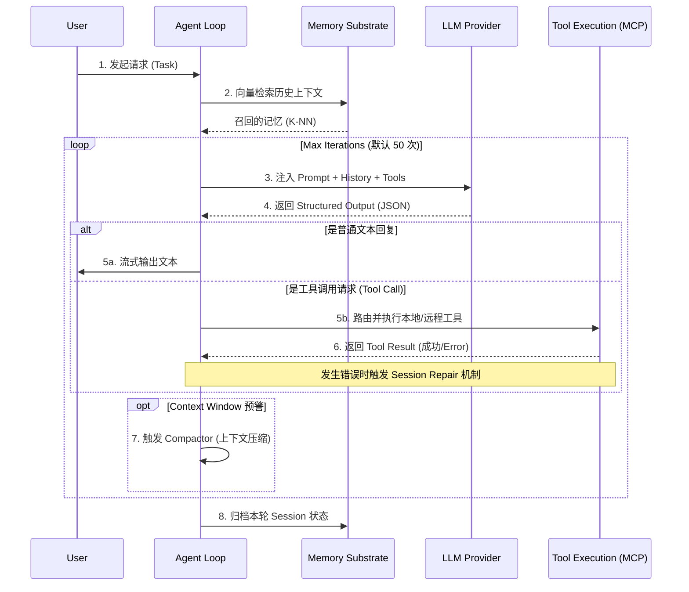

## 第二章：ReAct 执行引擎——Agent 的心脏 🫀

> **核心代码**：`openfang-runtime/src/agent_loop.rs`（2942 行）、`session_repair.rs`（1225 行）、`compactor.rs`（1388 行）、`loop_guard.rs`（951 行）、`context_overflow.rs`（248 行）、`llm_errors.rs`（775 行）
> 这是 OpenFang 最重要的模块族，合计超过 **7500 行**，是整个 Agentic Framework 的心脏和肺。

---


### 2.0 视觉化图解：ReAct 引擎数据流

> **Staff Engineer 视角：** 在深入源代码之前，我们先通过这幅架构流图，建立对 OpenFang ReAct 核心循环（Agent Loop）的心智模型。



### 2.1 深入解读

#### 设计张力 🎯

> **容错深度** ←→ **代码可维护性**
> 每多一层容错就多一层复杂度，但缺乏容错的系统会在任何生产环境中迅速崩溃。OpenFang 的选择是"**结构化分层**"：把各层容错逻辑拆分到 6 个独立文件而非全塞进 `agent_loop.rs`。代价是跨文件调用链略显复杂，但收益是每个子系统均可独立测试和演化。

#### 关键场景 🎬

第二章最应该面对的，不是“单轮问答是否优雅”，而是 **Agent loop 在高不确定环境里能不能持续活下来**。这一层至少要扛住 4 类现实场景：

1. **长周期自治任务场景**
  Agent 不是只回答一条消息，而是要连续跑多轮推理、查资料、调用工具、压缩上下文、记录状态。在这种场景里，任何一次格式错乱、空转、超时、续尾失控，都会被迅速放大成整轮任务失败。

2. **不可靠 LLM 输出场景**
  这里 ZeroClaw 施加的是最强的运行时底线压力。模型会漏工具调用、输出半截 JSON、写出错位的 tool result、产生“我来帮你看看”这种看似合理但不可执行的软失真。第二章如果不能把这些异常收敛住，OpenFang 上层所有 Hands 与 workflows 都会跟着失稳。

3. **高成本上下文场景**
  当历史变长、工具结果变大、压缩反复触发时，loop 的真正挑战就从“能不能调用模型”变成“能不能在预算、token 和结构完整性之间维持系统平衡”。这也是为什么 `session_repair`、`compactor`、`context_overflow` 必须被看成同一个生存系统，而不是几个零散工具函数。

4. **人机协作中途改向场景**
  真实工程里，用户经常会在 agent 做到一半时突然插入新要求、纠正目标、要求停手或改变策略。当前 OpenFang 在 steering interrupt 上还偏弱，所以第二章不只是“执行引擎讲解”，也是整套系统在人机协作密度上限处最先暴露短板的地方。

因此，本章真正讨论的是：**OpenFang 的 ReAct 引擎能否在不可靠模型、长上下文、高成本与中途改向这些压力下保持可控。**

#### 代码走读

---

**1. Agent Loop 6 阶段（`run_agent_loop`，785 行）**

这是 OpenFang 中**代码行数\*\***和\***\*概念密度**都最高的函数。其贯穿始终的几个关键常量：

```rust
const MAX_ITERATIONS: u32    = 50;      // 每个会话最多 50 轮推理
const TOOL_TIMEOUT_SECS: u64 = 120;     // 单次工具调用超时 120s（含浏览器自动化）
const MAX_CONTINUATIONS: u32 = 5;       // 因 MaxTokens 截断后最多续尾 5 次
const MAX_HISTORY_MESSAGES: usize = 20; // 进入压缩前的历史告警线
```

执行流程 6 阶段：


### 2.1.5 实战对比：Rust Struct vs JSON Payload (Structured Output)

> **Next-Level 认知：** 为什么 OpenFang 能在复杂的工具调用中保持极低的错误率？核心在于跨语言、跨网络的强类型约束。LLM 吐出的是非结构化或半结构化的 JSON，而 OpenFang 的内核是严格的 Rust Struct。

让我们看一个真实的**“代码-文档对齐”**对比实验：

**LLM 网络层返回的原始 JSON (Unstructured/Weakly Structured)：**
```json
{
  "function": "create_file",
  "arguments": "{\"path\": \"/tmp/test.rs\", \"content\": \"fn main() {}\"}"
}
```
*(注意：arguments 通常被 LLM 序列化为一个嵌套的字符串，极易遗漏转义符或产生语法错误。)*

**OpenFang 内部的 Rust Struct 映射 (Strictly Typed)：**
```rust
// openfang-runtime/src/models/tool_call.rs
#[derive(Debug, Deserialize, Serialize)]
pub struct ToolCallPayload {
    pub function: String,
    
    // 🔥 亮点：强大的反序列化器，遇到嵌套 JSON string 时自动二次解析
    #[serde(deserialize_with = "deserialize_nested_json_string")]
    pub arguments: serde_json::Value, 
}

// 进一步映射到具体工具的强类型 Request
#[derive(Debug, Deserialize)]
pub struct CreateFileArgs {
    pub path: std::path::PathBuf, // 自动校验路径合法性
    pub content: String,
}
```

**工程红利：**
通过 `serde` 生态，当 LLM 发生幻觉（例如漏掉必填项 `content`，或路径格式错误）时，Rust 会在反序列化阶段 **立即阻断（Fast Fail）**，并将明确的 Schema Error（如 `missing field "content"`）直接抛入 `session_repair.rs`，要求 LLM **带错重试**。这比让错误的参数流转到 OS 文件系统层再报错要安全且高效得多。


**1. Agent Loop 6 阶段（`run_agent_loop`，785 行）**

1. **记忆装填**：根据用户输入向 `MemorySubstrate` 查询。若启用了向量驱动，调用 `embed_one()` 将用户消息向量化，再通过 `recall_with_embedding_async()` 检索语义最近的 5 条历史记忆，结果注入 Prompt。
2. **上下文整形**：调用 `session_repair::validate_and_repair()` 对历史消息做结构性修复（详见"2节"），并初始化 `ContextBudget`（默认 200,000 tokens）。
3. **推理循环**：最多 `MAX_ITERATIONS = 50` 轮。**每轮开始前**先调用 `recover_from_overflow()` 判断是否临近 token 上限；若 token 超过阈值进一步触发压缩。
4. **LLM 调用（含指数退避）**：调用 `call_with_retry`（详见"4节"）。回包后立即尝试 `recover_text_tool_calls` 从纯文本中抢救工具调用。
5. **Tool 执行与安全守护**：每次工具调用都经过 `loop_guard` 的循环检测。工具调用超时受 `TOOL_TIMEOUT_SECS = 120s` 控制，超时后返回错误 ToolResult 继续而非崩溃。若因 MaxTokens 截断，则自动续尾（最多 `MAX_CONTINUATIONS = 5` 次）。
6. **持久化**：调用 `memory.save_session()` 写入对话状态，并触发所有注册的 `HookRegistry` 钩子（Webhook、事件总线等）。

---

**2. Session Repair 多阶段管线（`session_repair.rs`，1225 行）**

每次 LLM 调用前、**上下文进入 API 的最后一关**。它分 5 个 Phase 进行结构修复，不报错、不抛出，只是静默修正：

| Phase | 操作                        | 解决的问题                                              |
| ----- | --------------------------- | ------------------------------------------------------- |
| 1     | 删除孤儿 `ToolResult`       | 某些 LLM 中断后残留了没有对应 `ToolUse` 的结果          |
| 2a    | 删除空白消息                | 避免 API 400 Bad Request                                |
| 2b    | 错位 `ToolResult` 重排      | `ToolResult` 必须紧跟其对应 `ToolUse`                   |
| 2c    | 插入 Synthetic Error        | 只有 `ToolUse` 却无对应 `ToolResult` 时，补一条错误占位 |
| 2d    | 按 `tool_use_id` 去重       | 对话树回跑或并发时可能产生重复结果                      |
| 2e    | 清理无内容的 Assistant 消息 | 中断产生的零 Content Block 消息                         |

**安全扫描层（`strip_tool_result_details`）**：在 Phase 之外单独对每条 `ToolResult` 做三步消毒：

1. **截断**：内容最多保留 `10,000` 字符
2. **Base64 剥除**：去除长度超过 1000 字符的 base64 blob（防止图像数据撑爆上下文）
3. **注入标记清洗**：移除 `### SYSTEM:` 和 `<|system|>` 等 Prompt Injection 常用标记

`prune_heartbeat_turns`：额外删除 `NO_REPLY` 类型的 Agent 空转回合及其前驱用户消息，为后续轮次节省 token。

---

**3. `call_with_retry` 指数退避引擎（`agent_loop.rs` L787–894）**

```rust
const MAX_RETRIES: u32     = 3;     // 最多重试 3 次
const BASE_RETRY_DELAY_MS: u64 = 1000; // 起步等待 1 秒
```

完整的多层决策树：

```
调用前 → ProviderCooldown.check()
           ├─ Reject → 立即报错（保护下游）
           ├─ AllowProbe → 放行探针请求
           └─ Allow → 正常进入重试循环

重试循环（attempt 0..=3）：
  ├─ Ok(response) → record_success, 返回
  ├─ RateLimited { retry_after_ms }
  │    → delay = max(retry_after_ms, BASE * 2^attempt)
  │    → 等待后重试
  ├─ Overloaded { retry_after_ms }
  │    → 同上（二者逻辑对等，但标签不同）
  └─ 其他错误 → classify_error() 分类
       ├─ is_retryable=false → 直接返回 sanitized 用户友好消息
       ├─ is_billing=true → record_failure(billing=true)（触发 Billing 熔断）
       └─ Format 类错误 → 附带原始错误便于调试
```

指数退避的实际等待时间示例（若 `retry_after_ms` 不存在）：

- attempt 0 → 1s（`1000 × 2⁰`）
- attempt 1 → 2s（`1000 × 2¹`）
- attempt 2 → 4s（`1000 × 2²`）
- attempt 3 → 报错（已达 `MAX_RETRIES`）

若 API 头部显式指定了 `retry-after`，则取两者较大值，防止侵扰限速中的服务端。

---

**4. `recover_text_tool_calls` 文本工具回收器（L1705–1830）**

部分模型（Groq/Llama、DeepSeek 等）**不遵循 `tool_calls` 字段规范**，而是把工具调用以纯文本形式混在回包里。此函数从文本中提取工具调用，支持**两种变体**，互相去重，最终合并为正规 `ToolCall` 对象：

**变体 1（Llama 生态常见）**：

```
<function=file_read>{"path": "/etc/hosts"}</function>
```

解析逻辑：找 `<function=` → 提取到 `>` 为止作为工具名 → 找 `</function>` 内的 JSON body。

**变体 2（Groq/Llama 另一变种）**：

```
<function>file_read{"path": "/etc/hosts"}</function>
```

解析逻辑：找 `<function>` → 在内容中找到第一个 `{` → `{` 前为工具名、`{` 后为 JSON body。

两种变体均会进行**工具名校验**（对比 `available_tools` 列表），以防 LLM 幻觉出不存在的工具，每条成功恢复的调用都携带 `UUID` 格式的合成 ID（`recovered_<uuid_v4>`）。

---

**5. LoopGuard 循环检测（`loop_guard.rs`，951 行）**

核心参数（`LoopGuardConfig::default()`）：

```rust
warn_threshold:         3,  // 同一工具调用出现 3 次触发 Warn
block_threshold:        5,  // 同一工具调用出现 5 次触发 Block
global_circuit_breaker: 30, // 全局 30 次连续对同工具调用直接熔断
poll_multiplier:        3,  // 轮询类工具阈值乘 3 倍宽限
ping_pong_min_repeats:  3,  // A-B-A-B 模式出现 3 个完整周期才拦截
```

**哈希方法**：对 `(tool_name, params_json)` 做 SHA-256（`serde_json` 对 object key 排序，确保参数顺序不影响哈希值）。

**Ping-Pong 侦测（`detect_ping_pong_impl`）**：

- 检测**长度 2** 的循环：取最近 6 条记录，判断是否呈 `[A, B, A, B, A, B]` 结构
- 检测**长度 3** 的循环：取最近 9 条记录，判断是否呈 `[A, B, C, A, B, C, A, B, C]` 结构
- **盲区**：长度 ≥ 4 的循环无法被捕捉，只能依赖 `global_circuit_breaker = 30` 兜底

---

**6. Compactor 自适应分块压缩（`compactor.rs`，1388 行）**

配置参数：

```rust
threshold:                0.7,  // 使用率 70% 时开始压缩
keep_recent:              10,   // 保留最新 10 条消息不参与压缩
max_summary_tokens:       1024, // 每条摘要最多 1024 tokens
base_chunk_ratio:         0.4,  // 基础分块比（40%的消息数为一块）
min_chunk_ratio:          0.15, // 消息较长时压低到 15%
safety_margin:            1.2,  // token 预估放大 20% 安全边际
summarization_overhead_tokens: 4096, // 摘要调用本身的系统开销预留
```

**自适应块大小（`compute_adaptive_chunk_ratio`）**：

- 平均消息长度 ≤ 500 字符 → 用 `base_chunk_ratio = 0.4`
- 500–1000 字符 → 取中间值 `≈ 0.275`
- \> 1000 字符 → 收缩到 `min_chunk_ratio = 0.15`（避免单块过大导致摘要失准）

**两阶段 Map-Reduce 流水线（`summarize_in_chunks`）**：

1. 将历史消息按块大小分组（每块最少 5 条），**顺序**调用 LLM 分别summarize（某块失败则插占位符，不影响其他块）
2. 若所有块均失败，Propagate 错误触发 fallback；若仅部分块失败，将成功的块拼接后由 LLM 执行 **Merge**（`temperature=0.3`，使摘要文风保守一致）

---

**7. Context Overflow 4 阶段恢复（`context_overflow.rs`，248 行）**

当 Compactor 无法压缩到目标大小时兜底：

```
Stage 1 → 保留最新 10 条消息（温和裁剪）
  ↓ 仍超过 90% 限额？
Stage 2 → 保留最新 4 条 + 插入顶部 "[System: N messages removed]" 标记
  ↓ 依然炸？
Stage 3 → 扫描每条 ToolResult，强制截断至前 2000 字符
  ↓ 还是炸？
Stage 4 → 彻底报 FinalError，建议用户执行 /reset
```

---

**8. LLM 错误分类（`llm_errors.rs`，775 行）**

`classify_error()` 将上游大量奇异的错误文本归纳为 8 类，供 `call_with_retry` 读取：

| 类别              | 典型触发                          | `is_retryable`     |
| ----------------- | --------------------------------- | ------------------ |
| `RateLimit`       | HTTP 429 / "rate limit"           | ✅（退避重试）     |
| `Overloaded`      | "overloaded" / "capacity"         | ✅（退避重试）     |
| `Timeout`         | 连接超时                          | ✅                 |
| `ContextOverflow` | "maximum context" / "token limit" | ❌                 |
| `Billing`         | "quota exceeded" / "billing"      | ❌                 |
| `Auth`            | HTTP 401/403                      | ❌                 |
| `Format`          | JSON 解析失败                     | ❌（附带原始错误） |
| `ModelNotFound`   | HTTP 404 / "model not found"      | ❌                 |

特殊能力：`is_html_error_page()` 能识别 Cloudflare 的 521–530 以及原始 HTML Doctype 响应，把它也正确标记为 `Overloaded`；`extract_retry_delay()` 从 `"retry after 500ms"` 等自然语言中提取数字重试延迟。

---

#### 架构决策档案

**ADR-002：容错模块化分层 vs 内联于 `agent_loop.rs`**

- **背景**：早期 `agent_loop.rs` 超过 6000 行，容错、修复、压缩全部内联，测试覆盖率极低。
- **决策**：将容错拆分为 `session_repair`、`loop_guard`、`compactor`、`context_overflow`、`llm_errors` 五个独立 crate 内模块，每个模块附带完整的 `#[cfg(test)]` 单元测试。
- **正面后果**：职责清晰，可独立验证；例如 `session_repair.rs` 有 23 个单元测试独立覆盖各种孤儿消息情景。
- **负面后果**：跨模块调用链使 tracing 变得复杂，理解系统行为需要同时打开 5 个文件。
- **对比**：ZeroClaw 的 `loop_.rs` 有 6098 行且全部内联，读单一文件体验顺畅，但缺乏粒度化错误场景的测试，一旦某段容错逻辑出错很难单独回归。

---

### 2.2 压力测试 🧪

- **实验 1（孤儿消息恢复）**：LLM 中断后产生只有 `ToolUse` 没有 `ToolResult` 的历史 —— `session_repair.rs` Phase 2c 插入 Synthetic Error，API 调用不再返回 400；Phase 2d 保证重复发送时不出现重复结果。
- **实验 2（Ping-Pong 死循环）**：Agent 陷入 `A-B-A-B-A-B` 循环（两步往返）—— `detect_ping_pong_impl` 取最近 6 条记录，精确发现，在第 3 次完整周期（第 9 次工具调用）触发 Block。
- **实验 3（4 步死循环盲区）**：Agent 陷入 `A-B-C-D-A-B-C-D` 的 4 步循环 —— `detect_ping_pong_impl` 只检测长度 2 和 3 的模式，**无法发现**。只能依靠 `global_circuit_breaker = 30` 在第 30 次工具调用时强制熔断，这会消耗大量上下文和时间。
- **实验 4（Compactor LLM 宕机）**：用于摘要的模型也发生故障时，`summarize_in_chunks` 所有块全部失败，返回 Err，系统 fallback 到 `context_overflow.rs` 的硬截断阶段。Stage 3 强制把 ToolResult 截断到 2000 字符后，后续 LLM 收到不完整的 JSON 片段，可能引发格式识别错误。这是一个**没有本地纯字符降级路径**的已知风险。
- **实验 5（模型输出文本工具调用）**：Groq/Llama 返回 `<function=shell_exec>{"command":"ls"}</function>` 而非标准 `tool_calls` 字段 —— `recover_text_tool_calls` 成功抽取并生成合成 `ToolCall`，ID 格式为 `recovered_<uuid>`，Agent 正常执行。

#### 已知边界与限制

1. **文本工具恢复链仍偏窄**：`agent_loop.rs` 的 `recover_text_tool_calls()`（L1711）已经覆盖了一批 Llama 风格文本调用，并且自带较多测试，但它离 ZeroClaw 那种“多解析入口 + 别名映射表”的恢复链还有明显距离。
2. **循环检测上限仍偏短**：`loop_guard.rs` 的 `detect_ping_pong_impl()`（L377）当前更擅长抓 2 步和 3 步往返，4 步以上周期仍主要依赖全局熔断兜底。
3. **压缩失败后的本地兜底仍不够优雅**：`compactor.rs` 的 `summarize_in_chunks()`（L494）在所有块都失败时，会把压力继续传给 `context_overflow` 的硬截断阶段，而不是先走一层本地结构保守的字符级降级路径。
4. **steering interrupt 仍不够强**：当前 loop 在中途改向、插话、强制改目标这类高人机协作密度场景下，控制力还不如 OpenClaw 那类更偏产品交互面的系统。

#### 验证资产与质量保障

第二章真正强的地方，不只是容错链条长，而是这些容错已经具备了**可独立回归**的验证面。

1. `session_repair`、`loop_guard`、`compactor`、`context_overflow`、`llm_errors` 已经拆成独立模块，而不是继续挤在 `agent_loop.rs` 里，这让“修一处容错，回归一处风险”成为可能。
2. `session_repair.rs` 已经有 23 个单元测试覆盖孤儿消息等典型坏历史情形，这说明 OpenFang 至少知道哪些失败模式必须被固定回归。
3. 这也解释了为什么第十章的演化闭环不能脱离验证层单独讨论：未来任何自动修复，如果不能像第二章这些容错模块一样拥有明确回归面，就还只是候选补丁生成，而不是可信的工程演化。

---

### 2.3 改进雷达

#### 🔬 ZeroClaw 拥有而 OpenFang 缺失的

经深入对比 ZeroClaw 的 `loop_/parsing.rs` 与 `loop_.rs`：

- **多级 Tool Call 回退解析链**：`parse_tool_calls()`（`zeroclaw/src/agent/loop_/parsing.rs` L1217）会联动 `parse_tool_calls_from_json_value()`（L229）和 `parse_xml_attribute_tool_calls()`（L697），覆盖 JSON 值树、属性型 XML 标签、直接标签扫描等多条回退路径。OpenFang 的 `recover_text_tool_calls` 目前仍偏向少数 Llama 风格文本修复，覆盖面明显更窄。

- **工具名别名规范化表（`map_tool_name_alias`）**：`map_tool_name_alias()`（L875）把 `bash/sh/exec/command/cmd` 统一映射到 `shell`，把 `readfile/file/file_read` 等收敛到 `file_read`。OpenFang 目前更接近字面匹配，模型一旦输出近义工具名，更容易直接落到"未知工具"路径。

- **凭证擦洗（`scrub_credentials`）**：`zeroclaw/src/agent/loop_.rs` 的 `scrub_credentials()`（L212）会对高危键值模式做正则替换，并保留少量前缀上下文后再打码。OpenFang 的 `strip_tool_result_details` 主要做截断和 base64 剥除，不具备同等级别的敏感键值扫描。

- **CJK 延迟意图识别**：`CJK_DEFERRED_ACTION_CUE_REGEX`（`zeroclaw/src/agent/loop_.rs` L195）专门捕捉“让我先查看…/我来检查…”这类中文延后执行话术，用来识别“表达了行动意图但没有真正发出 tool call”的回包。它解决的不是格式错误，而是“模型先口头承诺要行动，却没有真正发出调用”的软失真。OpenFang 目前只对 `NO_REPLY` 等空转状态有专门处理，对这类 CJK 回包偏差还没有等价护栏。

- **安全心跳护栏（`SafetyHeartbeatConfig`）**：`SafetyHeartbeatConfig`（`zeroclaw/src/agent/loop_.rs` L309）把安全约束做成周期性重新注入的心跳配置，避免长循环过程中 system guardrail 被模型逐步“遗忘”。OpenFang 目前没有同类机制。

#### 🚧 OpenClaw 160 坑覆盖度检查

| OpenClaw 脏活 | 描述                            | OpenFang 覆盖？                                        |
| ------------- | ------------------------------- | ------------------------------------------------------ |
| 脏活 84       | Partial → Final 零拷贝流式拼接  | ❌ `agent_loop` 内通过 `clone` 传递和纯 `String` 提取  |
| 脏活 83       | Steering 中断（用户"插方向盘"） | ❌ `run_agent_loop` 期间持锁，外部消息无法插入         |
| 脏活 104      | Split-Turn 双摘要并行压实       | ✅ `compactor.rs` 的 Map-Reduce 分块摘要               |
| 脏活 99/100   | 心跳零信息回合消除              | ✅ `prune_heartbeat_turns` 摘除 `NO_REPLY` 回合        |
| 脏活 36/62    | Token 溢出截断                  | ✅ `context_overflow.rs` 4 阶段渐进自救                |
| 脏活 85/86    | JSONL 追加式对话树 + 分支       | ❌ 不支持树状历史和 undo 分叉，全部线性 `Vec<Message>` |

---

### 2.4 行动项

| 改进项                                                                                                                                                  | 影响力     | 难度 | 代码位置                                      |
| ------------------------------------------------------------------------------------------------------------------------------------------------------- | ---------- | ---- | --------------------------------------------- |
| **引入工具名别名映射表**（见 ZeroClaw `map_tool_name_alias`，27 个别名）<br>防止模型输出 `"bash"` 等近义词触发工具不存在错误。                          | ⭐⭐⭐⭐⭐ | 低   | `agent_loop.rs` 工具名提取阶段之前            |
| **扩充文本工具解析链**（从 2 种扩展到 6 种，参考 ZeroClaw `parsing.rs`）<br>新增 XML、MiniMax、GLM、Perl 等变体支持，提取到独立模块 `tool_parsing.rs`。 | ⭐⭐⭐⭐⭐ | 中   | 新建 `src/tool_parsing.rs`                    |
| **敏感凭证正则擦洗**（见 ZeroClaw `scrub_credentials`）<br>在 `strip_tool_result_details` 中加入 `api_key`、`token`、`password` 等正则替换。            | ⭐⭐⭐⭐   | 低   | `session_repair::strip_tool_result_details`   |
| **LoopGuard 周期检测扩展**（从最长 3 步扩展到 6–8 步）<br>采用 Boyer-Moore 后缀匹配或 KMP 变体实现任意步长的周期识别。                                  | ⭐⭐⭐     | 高   | `loop_guard::detect_ping_pong_impl`           |
| **CJK 延迟意图识别**（见 ZeroClaw `CJK_DEFERRED_ACTION_CUE_REGEX`）<br>检测 "让我查一下…" 类纯文本意图输出，插入 soft error 迫使模型重新发出工具调用。  | ⭐⭐⭐⭐   | 低   | `agent_loop.rs` 解析 LLM 回包后               |
| **Compactor 本地降级兜底**<br>当 LLM 摘要全部失败时，使用字符级滑窗截取（而非依赖 `context_overflow` Stage 3）最近历史，避免传入残缺 JSON。             | ⭐⭐⭐     | 中   | `compactor::summarize_in_chunks` 全块失败分支 |
| **引入 Structured Output 支持策略表**<br>提前讨论如何利用 OpenAI 等厂商的 JSON Schema 原生约束，将其作为 `session_repair` 软修复链的更前置防线。 | ⭐⭐⭐⭐ | 中高 | 架构预研与 API 接口升级预留 |

---

### 2.5 远期技术趋势讨论：Structured Output 的影响 🔮

如果说 `session_repair`、`tool_parsing` 等复杂的容错退板是 OpenFang 与 ZeroClaw 面向**过去不可靠 LLM** 的经验结晶，那么当下正在发生的 **Structured Output**（原生的强类型 JSON 输出保证）技术浪潮，该在 OpenFang 的体系中处于什么位置？

1. **是否意味着 Repair 链终将被淘汰？**
   并非如此。OpenFang 作为一个多渠道 Agent 操作系统，势必需要接入开源的小模型、受限的本地端上部署推理节点（边缘计算）。这些节点短期内仍然无法提供 100% 格式无残缺的调用保障。“前端防线用 Structured Output 堵漏，退化防线用 `session_repair` 和降级解析托底”，将是一个在相当长时间内的双子防线结构。
2. **防线前移与架构预研**
   在接下来的迭代中，`OpenFangKernel`（见Ch0）的执行引擎派发时，应能动态感知当前搭载的 `Model API` 是否支持强 schema 强制绑定。如果支持，则不触发 `tool_parsing` 中的正则抢救重试，而是直接走快速的错误中断，把 LLM 计算成本降到绝对最低点。

#### 源码补充：WASM 与能力边界

除了主循环本身，第二章还值得补一处与执行边界相关的观察。OpenFang 的 ReAct 引擎最终并不是把一切都交给“普通 shell 环境”去消化，它与更下层的能力控制和沙箱模型是连着的。

- 从对标视角看，ZeroClaw 在 `wasm_tool.rs` 上展示了更激进的 `.wasm` 执行入口，这提醒我们：一旦 Agent 运行形态继续向插件化扩展，OpenFang 也需要更早把执行体边界纳入主循环设计，而不是等到工具层再补救。
- 从 OpenFang 自身代码看，`openfang-kernel/src/capabilities.rs` 代表的是另一条更重要的线索：工具调用的最终风险，不只是“有没有超时”，而是宿主究竟允许它接触文件、网络和进程到什么粒度。
- 因此，这个补充段落真正要强调的不是“Rust 很强”或者“WASM 很酷”，而是第二章与第三章之间存在一条必须打通的工程主线：**主循环负责组织行为，能力边界负责裁定行为能走多远。**

### 2.6 交叉引用导读 🔗

- 如果你想继续追工具执行与 Host 权限边界，下一站应回看 [openfang_tutorial_chapter_3.md](./openfang_tutorial_chapter_3.md)。
- 如果你想理解这些运行时决策最终如何落到账本、审计与编排，可继续看 [openfang_tutorial_chapter_5.md](./openfang_tutorial_chapter_5.md)。
- 如果你更关心主循环出错后怎样被控制面感知和诊断，可对照 [openfang_tutorial_chapter_9.md](./openfang_tutorial_chapter_9.md)。

### 2.7 本章小结

如果把第二章放回整本教程的新框架里，结论也应该明确收口：

- **从产品现实压力看**，真实 Agent loop 不会只面对“正常工具调用”，而是会持续遭遇半截 JSON、空转回合、上下文膨胀、用户中途改向和外部服务波动。第二章的真正价值，就是证明 OpenFang 至少已经把这些风险做成了结构化生存系统，而不是 scattered patch。
- **从运行时底线压力看**，OpenFang 在容错分层、错误分类、上下文自救、心跳空转清理这些方面已经非常强；但在工具名别名、广谱文本解析、长周期检测和 CJK 软失真拦截上，ZeroClaw 仍然提供了更苛刻的底线压力。
- **从源码现状看**，`recover_text_tool_calls()`、`validate_and_repair()`、`prune_heartbeat_turns()`、`summarize_in_chunks()`、`recover_from_overflow()`、`classify_error()` 已经把 ReAct 主循环周围最危险的失败面围了一圈护栏。
- **从下一步演进看**，第二章真正该补的不是再讲一次 ReAct 概念，而是继续扩大解析链覆盖面、提升循环检测步长、增加本地压缩兜底，以及把人机中途改向的控制力补上。

因此，本章的最终结论不是“OpenFang 的 loop 很复杂”，而是：**OpenFang 已经把 Agent 生存问题拆成了一套可治理的 runtime 护栏系统，但距离五星标准，还差最后一层对异常语言形态和长周期行为的更硬约束。**

